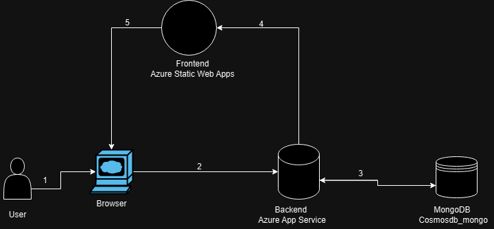
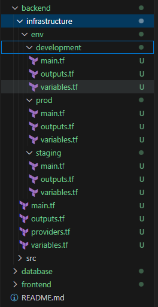
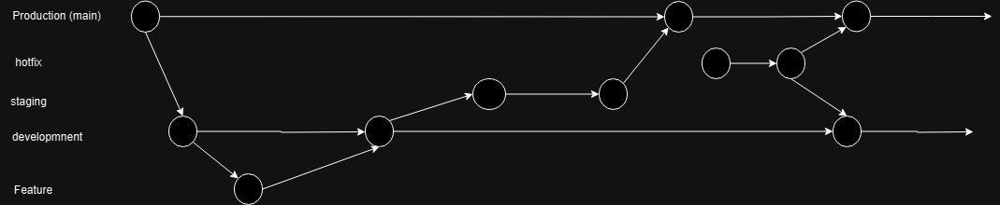

# 2 Solution Design
Design 1

Ich würde für das frontend eine [static Web Application wählen](https://azure.microsoft.com/en-gb/products/app-service/static)
meiner Meinung nach ist dies für eine Single Page Application gut geeignet.

Das Backend würde über als Azure App Service laufen und die NoSQL Datenbank würd über Cosmosdb Mongo gehostet.

Alternativ könnte man ein Azure Kubernetes Cluster auswählen. Die Frontend-Images müssten in einer Container Registry gespeichert werden. Für eine Single Page Application ist meiner Meinung nach der Einsatz von static Apps besser geeignet.

# 3 Implentierung
## 3.1.1 a
Die unterschiedlichen Umgebungen werden in der Infrastruktur unterschiedlich als Production, Staging und Development unterschieden

## 3.1.1 b
Frontend (vue.js), Backend (node.js), Infrastruktur (Terraform) und Datenbank (mongodb) sind in jeweilige Ordner unterteilt.

## 3.1.1 c 
Momentan sind die drei Komponenten Frontend, Backend und Datenbank in eigene Ordner aufgeteilt. Für die Infrastruktur wird ein extra Ordner angelegt. Eine weitere Lösung wäre alle 3 Software und Infrastruktur Komponenten stark zu trennen und die jeweiligen Komponenten in ein eigenes Repo zu packen.

 

Hier wäre ein Beispiel wie das Backend Repo aussehen könnte. Datenbank und Frontend wären in gleiche Source und Intrastruktur Ordner unterteilt. Jedes Repo hätte ein eigenes CI file.

## 3.1.2
### Push
Eine der populären Pipelines (GitLab CI/CD, Github Actions, Azure pipelines, Jenkins...) weiterhin können Linter und SonarQube zur statischen Code Analyse eingesetzt werden. Sowie Postman für API Tests.
### Pull
Bei einem Kubernetes ansatz Argo CD oder Flux CD.

## 3.1.3 , 3.1.4

Ich würde eine Feature Branching verwenden. Diese ist auch gut für die Arbeit im Team geeignet. Weiterhin sollten Merges in den Production und Staging Branch (eigentlich auch Dev) nur über Pull Requests möglich sein. Weiterhin sollte nicht jeder Nutzer diese bestätigen können. Für dev sollte ein weiterer Developer genügen, jedoch sollten bei Staging und Dev nur Admins oder Teamleads diese annehmen können.

## 3.1.5
Durch GitOps ist das Repository die single source of truth für Infrastruktur Definitionen. Diese wird wie auch der Sourcecode für die Anwendung im Repository gespeichert.

## 3.2.1
PaaS: Azure Static Web Apps, Azure Web Apps

SaaS: Github actions oder CI/CD der Wahl, Github oder repo der Wahl

## 3.2.2
Dort gibt es mehrere Möglichkeiten.
Meiner Meinung nach sollten Backend, Frontend und die Datenbank getrennt gehostet werden können damit die jeweiligen Teams speziell an ihrem Projekt arbeiten können. So muss z.B. wenn ein Typo im Frontend gefixt wird nichts am Backend oder der Datenbank geändert werden.

Für diese Single Page Application würde ich allerdings für jede Stage ein TF File schreiben, welches die komplette Logik enthält. Bei kleinen Projekten ist dies sicherlich angenehmer. Aber falls in der Zukunft mehr dazu kommen soll würde ich davon abraten.

## 3.2.3 
Feature Branch Workflow mit Pull Requests und dementsprechenden Repository Einstellungen, keine direkten Pushes auf Main und Staging.
Nur bestimmte Admins/Leads dürfen push Requests genehmigen.

## 3.2.4
Beispiel file [hier](ciexample.yaml)

